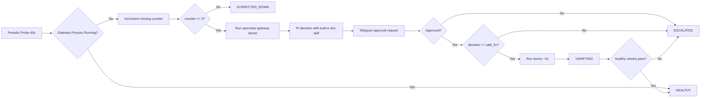

# openclaw-guardian

A cross-platform guard daemon for OpenClaw gateway recovery, built with OpenClaw PI packages (`@mariozechner/pi-agent-core`, `@mariozechner/pi-ai`).

## Architecture



## Locked behavior

- `openclaw.port` default is `18789`.
- Down condition is **no gateway process for 3 consecutive checks**.
- `openclaw gateway doctor` always runs before any fix attempt.
- `openclaw gateway doctor --fix` is never executed without explicit Telegram approval.
- Built-in skill `skills/openclaw-doc-first-fix/SKILL.md` is always used for PI guidance and is not configurable.

## Configuration

`config/config.yaml`

```yaml
openclaw:
  host: 127.0.0.1
  port: 18789
  health_path: /healthz
  process_name: openclaw-gateway
  log_path: /var/log/openclaw/gateway.log
  check_interval_sec: 60
  down_threshold: 3

telegram:
  enabled: true
  bot_token: "replace-with-telegram-bot-token"
  proxy: "" # optional: http://... / https://... / socks5://...

llm:
  provider: openai
  api_url: https://api.openai.com/v1
  api_key: "replace-with-llm-api-key"
  api_key_env: OPENCLAW_GUARDIAN_LLM_API_KEY
  model: gpt-4.1-mini
  timeout_sec: 30
```

Notes:
- Telegram supports `enabled`, `bot_token`, and optional `proxy`.
- `telegram.proxy` supports `http://`, `https://`, `socks://`, `socks4://`, `socks4a://`, `socks5://`, `socks5h://`.
- Send `/bind` to the bot once to bind your approval chat.
- `llm.api_key` in config is the primary credential source.
- `llm.api_key_env` is optional fallback if you prefer env-based secrets.
- Installer creates runtime env files for service mode:
  - macOS/Linux: `~/.openclaw-guardian/guardian.env`
  - Windows: `%USERPROFILE%\.openclaw-guardian\guardian.env.ps1`
- Official docs are fetched live from `https://docs.openclaw.ai/` on each diagnosis and are not cached.

## Quick install

### macOS / Linux

```bash
./scripts/install.sh --mode foreground --config config/config.yaml
```

### Windows (PowerShell)

```powershell
./scripts/install.ps1 -Mode foreground -ConfigPath config/config.yaml
```

Foreground mode installs/builds and then runs `openclaw-guardian` in the current terminal.

## Background service mode

### Linux (systemd user service)

```bash
./scripts/install.sh --mode background --config config/config.yaml
systemctl --user status openclaw-guardian.service
```

### macOS (launchd agent)

```bash
./scripts/install.sh --mode background --config config/config.yaml
launchctl print gui/$(id -u)/com.openclaw.guardian
```

### Windows (Scheduled Task service mode)

```powershell
./scripts/install.ps1 -Mode background -ConfigPath config/config.yaml
schtasks /Query /TN OpenClawGuardian /V /FO LIST
```

## Service control

### Linux

```bash
systemctl --user restart openclaw-guardian.service
systemctl --user stop openclaw-guardian.service
tail -f service.log
```

### macOS

```bash
launchctl kickstart -k gui/$(id -u)/com.openclaw.guardian
launchctl bootout gui/$(id -u)/com.openclaw.guardian
tail -f service.log
```

### Windows

```powershell
schtasks /Run /TN OpenClawGuardian
schtasks /End /TN OpenClawGuardian
Get-Content service.log -Wait
```

## Local docs snapshot

Keep OpenClaw docs in `references/openclaw-docs/`.

- `gateway-doctor.md`
- `gateway-recovery.md`

The PI decision module reads this local snapshot before classifying a fix as `safe_fix`.
It also fetches live official docs from `https://docs.openclaw.ai/` for each diagnosis and does not cache them.

## Fix history

Every incident writes structured history for later reference to:

- `~/.openclaw-guardian/fix-history.jsonl` (macOS/Linux)
- `%USERPROFILE%\.openclaw-guardian\fix-history.jsonl` (Windows)
- `~/.openclaw-guardian/fix-history.md` (macOS/Linux)
- `%USERPROFILE%\.openclaw-guardian\fix-history.md` (Windows)

Each record includes:
- when (`when_started_iso`, `when_ended_iso`)
- what happened
- fix procedure
- evidence (doctor/log/decision/approval/fix output excerpts)
- final result

## Build

```bash
npm run build
npm run check
```
